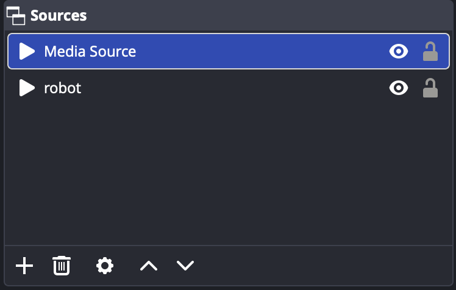
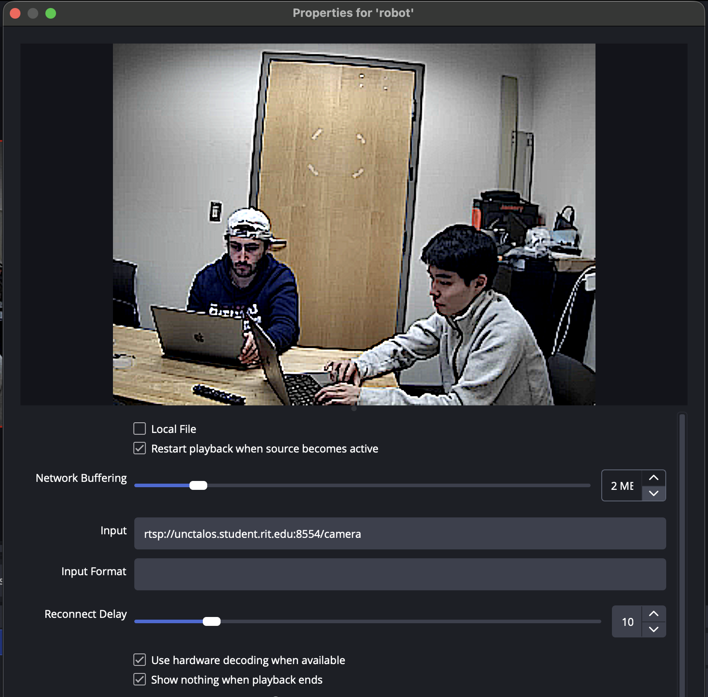

# Commander
[](https://deepwiki.com/talos-rit/commander)

Python desktop application that tracks subjects using video feeds from the robot and move the arm to keep subject in field of view.

## Installation

Create virtual environment and install required packages.
Using python package manager: [uv](https://docs.astral.sh/uv/getting-started/installation/)
```bash
uv sync
```
or alternatively
```bash
mkdir -p .venv/py3.12
python3.12 -m venv .venv/py3.12
pip install -r requirements.txt
```

**Optional Installation**
You can also opt in to install several other object detection models.

1. mediapipe
    * Run `uv sync --extra mediapipe`
    * This will add the mediapipe model options in the model dropdown menu
2. yolo
    * Run `uv sync --extra yolo`
    * This will add the yolo model option in the model dropdown menu
3. all
    * Run `uv sync --all-extras`
    * This will add all of the extra model options in the dropdown menu

## Known bugs with arm based macs
1. **Installation fails to build pybullet**
If pybullet build fails set a flag during installation:
```bash
CFLAGS="-Dfdopen=fdopen" pip install -r requirements.txt
```
or with uv
```bash
CFLAGS="-Dfdopen=fdopen" uv sync
```
2. **Tcl wasn't installed properly**
when running `uv run talos.py`, an error occurs:
`This probably means that Tcl wasn't installed properly.`.
Fix: `brew install tcl-tk` 
if this doesn't work, reinstall python for uv
`uv python uninstall 3.12 && uv python install 3.12`


## Running

Using uv, run the general app entry point:
```bash
uv run commander
```

Run the TUI interface:
```bash
uv run commander-terminal
```
or
```bash
uv run commander -t
```

Run the Tk GUI interface:
```bash
uv run commander-tk
```

### Web UI
`commander-web` serves a React operator UI on localhost (default <http://127.0.0.1:8000>). It needs [bun](https://bun.sh) (to install) and [pnpm](https://pnpm.io) (to run scripts) to build the frontend once:
```bash
cd web
bun install
pnpm run build
cd ..
uv run commander-web
```
Pass `--connection <host>` to open a robot from `robot_configs.local.yaml` as Camera 1 on startup, or pick it in **Settings**.

- **One robot is enough.** Camera 1 is the only required slot. Assign a Camera 2 in Settings to unlock the *One screen / Two screen* tabs.
- **One screen** shows a single feed. *Manual* lets you pick Cam 1 / Cam 2 (keys `1` / `2`); *Dynamic* will switch automatically (switching logic is still a stub and currently holds the camera you last chose).
- **Two screen** shows both feeds side by side; click a feed to choose which robot the controls act on.
- **Simple** mode only shows *Home* (`H`) and *Auto-Track* (`T`). **Debug** mode adds the jog pad (arrow keys), the detection model picker and live Operator telemetry.
- Tracking uses a YOLO model (`yolo_nano` unless you pick another). That needs the optional extra: `uv sync --extra yolo`. Haar (`basic`) and MediaPipe are not offered in this UI.
- **Settings** add/edit/remove robots (`config/robot_configs.local.yaml`) and save defaults such as camera slots, layout, interface mode, tracking model and web host/port (`config/app_settings.local.yaml`).

For frontend development, run the backend and the Vite dev server (proxies `/api` to `COMMANDER_API`, default `http://127.0.0.1:8000`):
```bash
uv run commander-web
pnpm --dir web dev
```

## Configurations
The `config/example_default_config.yaml` file contains default parameters for the application that will be used to fill in the new connections configs. You can override these parameters using `config/default_config.local.yaml` which will be prioritized over the example default config. 

When you create a new connection in the commander application, it will automatically create a new config file, `config/robot_configs.local.yaml`. This file will contain the parameters for each connection you create. You can also edit this file directly to change the parameters for each connection.

### App settings overrides
`AppSettings` are loaded from `config/app_settings.local.yaml`, and can be overridden by environment variables.

Priority order:
1. Environment variables (including `.env`)
2. `config/app_settings.local.yaml`
3. Hardcoded defaults in the schema

Supported environment variables:
- `COMMANDER_LOG_LEVEL`
- `COMMANDER_BBOX_MAX_FPS`
- `COMMANDER_FRAME_PROCESS_FPS`
- `COMMANDER_WEB_HOST` / `COMMANDER_WEB_PORT` (also `--web-host` / `--web-port`)

Example:
```bash
export COMMANDER_BBOX_MAX_FPS=15
uv run commander
```


## Running Tests
To run the tests, use the following command. By default, this command will run both unit and integration tests and generate a coverage report:
```bash
uv run pytest
```
To run only unit tests:
```bash
uv run pytest tests/unit/
```
To run only integration tests:
```bash
uv run pytest tests/integration/
```
To run the web UI tests (Vitest) and coverage:
```bash
pnpm --dir web test
pnpm --dir web coverage
```

## Setting up the virtual camera
In order to stream video out of commander, you will need to set up a virtual camera on your computer. This will allow you to select the commander video stream as a camera input in other applications (e.g. zoom, obs, etc.). 




1. find sources window
2. click "+"
3. select "Media Source"
4. unselect "Local File"
5. Add video feed endpoint into "input" textbox (for example: "rtsp://unctalos.student.rit.edu:8554/camera", "rtsp://localhost:8554/camera")



6. find "Controls" window
7. click "Start Virtual Camera"

This should add virtual camera as an option for camera input in zoom for example.

Please refer to the pyvirtualcam documentation for instructions on how to set up a virtual camera on your operating system: https://github.com/letmaik/pyvirtualcam.

> [!NOTE] If you are on MacOS or Windows the default backend for pyvirtualcam is obs while v4l2 is the default for Linux. If you want to use the obs backend on MacOS or Windows, you will need to have obs installed and running. Refer to pyvirtualcam's documentation for additional setup instructions. If you want to use the v4l2 backend on Linux, you will need to have v4l2loopback installed and set up.**

## Static Analysis
To run static analysis using sonarqube locally, you can use the provided docker-compose file to set up a SonarQube instance. The following steps outline how to setup your environment so that you can run SonarQube properly.

1. Make sure you have docker and docker-compose installed on your machine.

2. Copy the .env.example file to .env
```bash
cp .env.example .env
```
Then update the values in the .env file as needed. The default values should work for most cases, but you can change the `SONAR_NEW_PASS` value to something more secure if you plan on using this in a production environment.

3. Configure proper permissions:
```bash
sudo chown -R 1000:1000 .
```

4. Create the xml reports for coverage and test results by running the following command:
```bash
uv run pytest --cov-report=xml:coverage.xml --junitxml=pytest_report.xml
```

5. Run the following command in the root directory of the project:
```bash
docker-compose -f docker-compose.sonarqube.yml up -d
```

6. See the results.
```bash
visit http://localhost:9888 in the browser
login with the credentials from .env
```

7. If you want to run the analysis again after making changes, make sure to regenerate the xml reports by running the command in step 4 again, then run the following command to trigger a new analysis:
```bash
docker compose -f docker-compose.sonarqube.yml run --rm sonarscanner
```

You can use `docker-compose -f docker-compose.sonarqube.yml down` to stop the SonarQube instance when you are done.

## Troubleshooting
If you are having trouble connecting to the arm, try running the following command on the Pi:
```bash
ls /dev/tty*
```
and ensure that you see a device named `/dev/ttyUSB0`
If you don't see it, try unplugging and replugging the arm and running the command again. If it still doesn't show up, try restarting the Pi.
If you see the device, but still can't connect, try running the following command on the Pi:
```bash
screen /dev/ttyUSB0 9600
```
Hit enter a few times to see if `>` shows up on each line. If it does, then the arm is connected properly. If not, try restarting the robot arm and running the command again.
After testing, exit the screen session by typing `Ctrl+A` then `K` then `Y`.

## Known issues
Some devices have trouble using PySide interface due to QT installation issues. 
Currently we don't have a fix for resolving Qt but we suggest switching to other interfaces.
