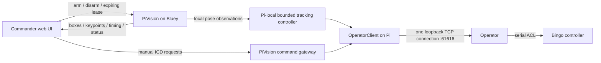

# PiVision integration and measurements — October 1, 2026

Commander worktree: `D:/GitHub/senior_project/commander-vision-integration`, branch
`integration/pivision-control`, based on the Commander web rewrite
`origin/feat/web-ui` at `bffddbe`. The initial integration is now committed as
`8c60856`; the follow-up changes remain uncommitted. Existing changes in the
original Commander and Operator checkouts were preserved.

## Running result

Open **http://127.0.0.1:8000**. The isolated console is configured for Bluey and
`http://bluey.local:5051`. To launch it again, run `tools/Start-VisionConsole.ps1`.
The production frontend is built. Auto-Track arms/disarms Pi-local control; the
PiVision pause button separately suspends inference and revokes automation.

On Bluey, `pivision-integration.service` is enabled and runs the staged code at
`/home/pi/talos-vision-releases/20261001T234226Z-ee7aed4e`. It starts **disabled**, with
`--edge-control`; the existing `/home/pi/test/tracker` source was not overwritten.
Operator now runs the development `twinning` commit `5a18ea6` from
`/home/pi/operator-dev-5a18ea6-lowlatency`, with `/home/pi/operator-dev` pointing to it.
This build includes an uncommitted fix that waits for controller prompts before
dispatching queued ACL commands, preventing collisions with LISTPV replies.
Delay-only queue entries retain the current prompt because they transmit no
bytes; the earlier serial build incorrectly consumed it and stalled all later
commands. A pipe-based regression test covers delay then HERE transmission.
The jog prompt check now distinguishes manual mode from direct-command mode,
allowing repeated jog bytes once manual mode is entered. The running tracker uses
continuous Pi-local following with 150 ms watchdog refresh, rather than timing
short pulses from TCP dispatch before serial mode changes finish. The continuous
frame-age allowance includes 300 ms for the measured inference processing delay;
the old 350 ms cutoff repeatedly rejected normal 370--410 ms observations.
All 45 Pi software tests pass. During the user's supervised Auto-Track trial,
counts changed from all zeros to base -1284 and pitch 255; user confirmation of
following quality after the final frame-age adjustment remains pending.
The user subsequently confirmed automatic following. The next iteration addresses
reported pitch overshoot: typed hardware operation `TrackingJog` (6) sets the
manual-byte interval directly, retaining the 500 ms watchdog and normal manual
jog rate. Base varies from 5--60 jog bytes/s, pitch 5--30, proportional to normalized
error; actual cadence is quantized by Operator's poll interval. A filtered target
velocity predicts arrival using capture age plus 80 ms; crossing the center stops
the axis instead of reversing based on that extrapolation. Missing detections stop
and reset velocity before reacquisition. All 48 Pi tests and three Operator CTest
suites pass; physical pitch tuning for this iteration is still pending.
The user reported continued pitch oscillation. The current iteration reduces
pitch to 5--10 jog bytes/s, resets velocity on stop, and adds a 4% image-height
margin before leaving CENTERED. Tracking stops now bypass the unused DELTA
reference update (DEFP, 500 ms delay, HERE); ordinary manual stops retain it.
Forward/backward optical flow advances completed pose boxes, aim points, and
keypoints from the inference frame to the newest image at 320-pixel processing
width. Unreliable flow falls back to the original pose, without manufacturing
confidence. A live sample reported `motion_compensated=true`, 89 ms image age,
and 415 ms original pose age. This is coordinate alignment, not a measured
physical response time. All 51 Pi tests pass.

The official [Controller-A ACL manual](https://downloads.intelitek.com/Manuals/Robotics/Discontinued_Machines/Controller_A/100083-a%20ACL44-Ctrl-A.pdf)
documents ramped MPROFILE motion and blended MOVES waypoint paths. It also says
MOVE deposits destinations in a movement buffer; live replacement of the active
destination is not established. Native trajectory mode remains unimplemented
and unverified on Bingo. Manual-key repeat parameter PAR 300 may also affect
smoothness; no controller parameters have been changed.
The candidate passed all three CTest suites before replacing the old process;
one `erv` owns `/dev/ttyUSB0`. PiVision receives fresh joint counts from this
build. The old `/home/pi/test` files and tracker model are preserved.
`operator/start_dev.bat` and the deployment wrappers now use the development
path. Restarting Operator queues HOME. Automatic tracking remains off after
the switch; physical tracking after this replacement is not yet verified.
Commander provides **Clear error**, using the existing typed EnableControl
operation through PiVision. A live request produced ACL TX `CON`, controller RX
`CONTROL ENABLED.`, and a cleared PiVision fault latch. The frontend build and
all 14 PiVision web backend tests passed.

## Control ownership



Detection-to-motion never needs Commander or a network round trip. Commander
maintains a **1.5 second lease**, renewed independently of frame frequency. Late
renewals cannot rearm an expired/revoked lease. The Pi checks expiry at 60 Hz,
independently of inference, and its pulse deadline service also runs at 60 Hz.
Operator's 500 ms watchdog is unchanged.

Operator accepts one TCP client. Configuring `pi_vision_url` selects Commander's
`EdgePublisher` HTTP adapter, leaving PiVision as the sole local TCP owner. It
preserves the existing ICD command payloads. Manual motion is rejected during
automation; explicit Stop/Home revoke the lease. Manual controls, camera selection,
removal, and shutdown release Commander's lease. Gateway responses say dispatched,
not physically completed; neither a dispatch nor Operator ACK proves motion.

The Pi controller uses fresh camera frames, bounded pulses, post-stop settling
and fault latching. Joint telemetry is optional; fresh counts can apply the
configured joint-count limits. Pitch now uses the
existing Operator wrist-pitch path; custom count limits are optional. Robot speed
and maximum observation age are configured through
`pi_vision_speed_percent` (default 20) and `pi_vision_max_age_s` (default 0.35).
HTTP connections are reused: opening a fresh connection/DNS lookup for every
observation reduced the workstation diagnostic probe to about 1.1 FPS; keeping
connections alive raised that probe to 4.2 FPS. That diagnostic transport never
paces local robot control.

## Video and model measurements

The Pi is a Raspberry Pi 4, roughly 2 GB RAM, at 1.5 GHz, with no throttling flag
during the measurements. Only short probes and bounded journal windows were read.

The running camera configuration uses **1280×720 raw YUYV at 10 FPS**, the camera's
advertised raw rate, and **hardware H.264 encoding** through `h264_v4l2m2m`
(`/dev/video11`). It uses about 8% of one CPU core in the observed process sample,
versus roughly 37% for the original 640×480 software encoder (different source
formats/rates, so this is an operational comparison, not a controlled codec test).
Commander decoded approximately 9.9 FPS and its JPEG output remained 1280×720.
The camera process remained unchanged across the later probes.

With this stream, four ONNX threads and spinning disabled, a 10 second Pi-local
probe measured **4.84 observations/s**, **207 ms median inference**, and **320 ms
median age when a new completed observation was sampled**. A workstation probe
measured 4.2 observations/s, 216 ms median inference and 289 ms median observation
age (420 ms p95). These are decoded-frame/perception timings, **not physical
camera exposure timestamps or measured actuator response**.

Resolution-specific YOLO11n-pose ONNX exports were generated on the workstation
and staged on the Pi. Warm CPU-only measurements, with the normal camera service
running and no concurrent tracker, used 12 runs per case:

| Model input | Median inference, four threads, no spinning | Approx. inference ceiling |
|---|---:|---:|
| 320×320 | 171 ms | 5.9 FPS |
| 416×416 | 284 ms | 3.5 FPS |
| 640×640 | 651 ms | 1.5 FPS |

These synthetic-input benchmarks exclude capture, postprocessing and motion.
Higher resolution runs successfully but costs latency; the active tracking model
therefore remains 320. An ROI can concentrate those pixels on a relevant region.
Pose output parsing now filters low-confidence anchors before the Python loop and
validates fixed input/output shapes. `POSE_THREADS` and `POSE_SPINNING` are tunable.
ONNX Runtime documents the CPU/power tradeoff of thread spinning in its
[threading guide](https://onnxruntime.ai/docs/performance/tune-performance/threading.html).

Hardware H.264 **decoding** through `/dev/video10` worked in a short system-FFmpeg
probe, but the combined capture pipeline lost the RTSP feed during repeated live
tests. It is available as an explicit experimental `--capture-backend
ffmpeg-hardware` option; the running service uses single-thread software decode.
Hardware encode is enabled and tested. Both codecs being listed by FFmpeg does not
establish that the combined pipeline is stable on this kernel/firmware/build.

720p/30 MJPEG input also produced dropouts. Its camera-format negotiation advertises
30 FPS, but that did not establish sustained operation. The running 720p/10 raw
preset avoids that input path. `cam_streamer/camera-640-hardware.conf` provides the
tested 640×480/30 alternative when lower video latency matters more than resolution.

## Why motion remains conservative

PiVision has an image-error proportional pulse controller, not a full visual PID.
The separate motor servo controller may already use PID: Intelitek's
[Controller-A manual](https://downloads.intelitek.com/Manuals/Robotics/Discontinued_Machines/ER_V_plus_manual_100016.pdf)
documents motor PID and a 10 ms control cycle. That specification is for the
documented Controller-A/ER-Vplus system; Bingo's exact controller revision still
needs confirmation before applying its tuning details.

The larger proven delays in this stack include pose inference, 20% tracking speed,
short pulses, and serial stop/reference recovery. Bluey's deployed Operator has a
100 ms stop-reference queue delay and a manual-exit telemetry deferral; local
Operator has a 500 ms stop queue delay plus a post-queue quiet guard. They differ.
Those waits protect the shared ACL parser and were preserved. Removing them or
adding an aggressive outer PID before measuring physical step response risks
reintroducing command collisions and overshoot. No motor PID values were changed.

## Validation and rollback

The focused Commander tests cover the web backend, control handoffs, observation
validation, lease supervision, HTTP Publisher framing, all connection tests and App
connection creation. Pi tests cover local pulse stops, fresh feedback, lease expiry,
ownership conflicts, late-renewal rejection and manual command arbitration.
Final local checks passed: **192 Commander/deployment tests, 39 Pi controller/API tests, and 99
frontend tests**. The production frontend builds. The running console reports
video present, Pi-local control, live observations, and automation disabled.
After the follow-up fixes, the user performed a supervised check and reported
that Auto-Track **stays on and moves**. No complete physical latency, directional
accuracy or pitch calibration test has been performed.

### Follow-up: missing Commander skeletons and automation dropouts

The initial integration transported detections but did not connect them to
Commander's video renderer. The renderer now draws scaled, confidence-filtered
COCO skeletons, boxes and aim points in both snapshots and MJPEG, including while
automation is off. An actual 1280×720 image served by Commander was inspected and
confirmed to contain the skeleton. Old observations are hidden after one second;
the capture frame is never modified. PiVision's diagnostic GUI also keeps its
pose overlay while movement is disabled.

Observation polling now runs independently of lease renewal. An observation
timeout cannot disable local autonomy. Renewal transport failures retry only
within the existing confirmed lease; expiry/revocation never automatically rearms
the robot. Commander shows compact controller state. A revoked lease's reason
survives subsequent successful status requests in the diagnostic API.

### Local follow-up awaiting reconnection

The user requested no Pi access or device actions while disconnected. The changes
below are implemented and tested locally but have **not been deployed** to Bluey
or loaded into the existing Commander backend process:

- Commander has a 5–80% centering-tolerance slider with 250 ms request coalescing.
  Its `PUT /api/control/pi-vision/tuning` gateway updates the Pi's
  `/api/v1/control/tuning` endpoint without stopping, rearming or extending the
  existing control lease. A smaller ratio gives a smaller central box. The box is
  drawn in Commander using the Pi's reported active value. The value survives
  off/on toggles within this Commander session; service restart uses the configured
  initial value.
- Pitch corrections are restored without requiring custom count limits. Both
  vertical directions use the existing Operator altitude command. The dominant
  normalized image error selects the next base or pitch pulse. Optional configured
  count limits still apply; no Operator change or restart is needed.
- The UI contains controls, labels and values, without explanatory paragraphs or
  controller-thought text. Detailed diagnostics remain in the API.

When reconnected, stage the updated Pi tracker files into the integration directory
and restart **only PiVision**, then restart Commander and refresh its page. Starting
Operator is unnecessary. The restored pitch path needs a supervised physical check;
its up/down dispatch and pulse bounds have passed the local tests.

### Deployment script

From the Commander integration worktree:

```powershell
.\tools\Deploy-PiVision.ps1 -RestartCommander
```

This builds the frontend, uploads the tracker Python files as a checksummed release,
verifies the existing Pi environment/model, switches PiVision's systemd working
directory, and restarts PiVision. `-RestartCommander` also restarts this worktree's
console in the background and checks its HTTP health. Operator and the camera
service are not restarted. Tracking starts off after deployment.

To prepare and verify a bundle without SSH, service changes, or a Commander restart:

```powershell
.\tools\Deploy-PiVision.ps1 -PrepareOnly
```

The defaults are `pi@bluey.local` and `/home/pi/talos-vision-releases`.
Old releases remain available. If the PiVision startup health check fails, the
installer restores the previous systemd override and restarts that release.
The script assumes the existing integration service and tracker environment are
installed. The offline preparation path has been run successfully; remote apply
has not been tested while the user is disconnected.

### Enable Tracking rejection diagnostics

Commander previously discarded FastAPI's `detail` field when PiVision rejected an
enable request, replacing every failure with a generic HTTP 409. The local fix
retains PiVision's actual rejection message and HTTP status. Transport failures
return 502 instead of 409, and the last failed enable reason remains in the status
API. Regression tests cover ownership conflicts, unavailable measured feedback,
Operator errors and transport timeouts. The underlying cause of the user's live
409 has not been determined: they requested continued local work without reading
device status. This diagnostic fix also awaits deployment/restarting Commander.

The user subsequently identified telemetry as the enable blocker and explicitly
requested movement without it. All telemetry requirements were removed from the
local controller's enable path, ongoing movement and post-stop pulse pacing. Fresh
video plus the settling interval pace corrections; fresh joint counts are optional
inputs to count-limit checks. Missing or stale counts never gate movement. Local
tests cover arming through the actual ControlLease/TrackingController combination
with no telemetry, both pitch directions, base correction and subsequent pulses.
This behavior awaits PiVision deployment; no device actions were taken offline.

The camera override is `/etc/systemd/system/camera-streamer.service.d/20-talos-720p.conf`;
the original `/opt/camera-streamer/scripts/stream_camera.sh` and original unit remain
untouched. To restore the original camera configuration:

```sh
sudo rm /etc/systemd/system/camera-streamer.service.d/20-talos-720p.conf
sudo systemctl daemon-reload
sudo systemctl restart camera-streamer.service
```

To stop the integration service without touching Operator:

```sh
sudo systemctl disable --now pivision-integration.service
```

Models remain under `test/pi_tracker` locally and
`/home/pi/talos-vision-integration-20261001` on Bluey. Reproducible probes are
`test/pi_tracker/scripts/benchmark_pose.py`, `probe_perception.py`,
`cam_streamer/scripts/benchmark_encoder.py` and Commander's
`tools/probe_pi_vision.py`.
