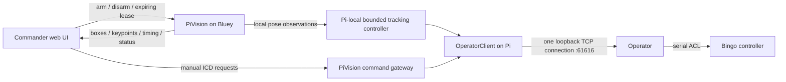

# PiVision integration and measurements — October 1, 2026

Commander worktree: `D:/GitHub/senior_project/commander-vision-integration`, branch
`integration/pivision-control`, based on the Commander web rewrite
`origin/feat/web-ui` at `bffddbe`. Changes are uncommitted. Existing changes in the
original Commander and Operator checkouts were preserved.

## Running result

Open **http://127.0.0.1:8000**. The isolated console is configured for Bluey and
`http://bluey.local:5051`. To launch it again, run `tools/Start-VisionConsole.ps1`.
The production frontend is built. Auto-Track arms/disarms Pi-local control; the
PiVision pause button separately suspends inference and revokes automation.

On Bluey, `pivision-integration.service` is enabled and runs the staged code at
`/home/pi/talos-vision-integration-20261001`. It starts **disabled**, with
`--edge-control`; the existing `/home/pi/test/tracker` source was not overwritten.
Operator is currently stopped. Nothing was sent to the real controller and no
physical motion was tested. Starting Operator can HOME Bingo, so physical testing
still requires a clear workspace and someone supervising the robot.

## Control ownership



Detection-to-motion never needs Commander or a network round trip. Commander
maintains a **1.5 second lease**, renewed independently of frame frequency. Late
renewals cannot rearm an expired/revoked lease. The Pi checks expiry at 60 Hz,
independently of inference, and its pulse deadline service also runs at 60 Hz.
Operator's 500 ms watchdog is unchanged.

Operator accepts one TCP client. Configuring `pi_vision_url` selects Commander's
`EdgePublisher` HTTP adapter, leaving PiVision as the sole local TCP owner. It
preserves the existing ICD command payloads. Manual motion is rejected during
automation; explicit Stop/Home revoke the lease. Manual controls, camera selection,
removal, and shutdown release Commander's lease. Gateway responses say dispatched,
not physically completed; neither a dispatch nor Operator ACK proves motion.

The Pi controller retains fresh video/telemetry checks, calibrated base limits,
bounded pulses, post-stop feedback gating, fault latching and default pitch
inhibition. Robot speed and maximum observation age are configured through
`pi_vision_speed_percent` (default 20) and `pi_vision_max_age_s` (default 0.35).
HTTP connections are reused: opening a fresh connection/DNS lookup for every
observation reduced the workstation diagnostic probe to about 1.1 FPS; keeping
connections alive raised that probe to 4.2 FPS. That diagnostic transport never
paces local robot control.

## Video and model measurements

The Pi is a Raspberry Pi 4, roughly 2 GB RAM, at 1.5 GHz, with no throttling flag
during the measurements. Only short probes and bounded journal windows were read.

The running camera configuration uses **1280×720 raw YUYV at 10 FPS**, the camera's
advertised raw rate, and **hardware H.264 encoding** through `h264_v4l2m2m`
(`/dev/video11`). It uses about 8% of one CPU core in the observed process sample,
versus roughly 37% for the original 640×480 software encoder (different source
formats/rates, so this is an operational comparison, not a controlled codec test).
Commander decoded approximately 9.9 FPS and its JPEG output remained 1280×720.
The camera process remained unchanged across the later probes.

With this stream, four ONNX threads and spinning disabled, a 10 second Pi-local
probe measured **4.84 observations/s**, **207 ms median inference**, and **320 ms
median age when a new completed observation was sampled**. A workstation probe
measured 4.2 observations/s, 216 ms median inference and 289 ms median observation
age (420 ms p95). These are decoded-frame/perception timings, **not physical
camera exposure timestamps or measured actuator response**.

Resolution-specific YOLO11n-pose ONNX exports were generated on the workstation
and staged on the Pi. Warm CPU-only measurements, with the normal camera service
running and no concurrent tracker, used 12 runs per case:

| Model input | Median inference, four threads, no spinning | Approx. inference ceiling |
|---|---:|---:|
| 320×320 | 171 ms | 5.9 FPS |
| 416×416 | 284 ms | 3.5 FPS |
| 640×640 | 651 ms | 1.5 FPS |

These synthetic-input benchmarks exclude capture, postprocessing and motion.
Higher resolution runs successfully but costs latency; the active tracking model
therefore remains 320. An ROI can concentrate those pixels on a relevant region.
Pose output parsing now filters low-confidence anchors before the Python loop and
validates fixed input/output shapes. `POSE_THREADS` and `POSE_SPINNING` are tunable.
ONNX Runtime documents the CPU/power tradeoff of thread spinning in its
[threading guide](https://onnxruntime.ai/docs/performance/tune-performance/threading.html).

Hardware H.264 **decoding** through `/dev/video10` worked in a short system-FFmpeg
probe, but the combined capture pipeline lost the RTSP feed during repeated live
tests. It is available as an explicit experimental `--capture-backend
ffmpeg-hardware` option; the running service uses single-thread software decode.
Hardware encode is enabled and tested. Both codecs being listed by FFmpeg does not
establish that the combined pipeline is stable on this kernel/firmware/build.

720p/30 MJPEG input also produced dropouts. Its camera-format negotiation advertises
30 FPS, but that did not establish sustained operation. The running 720p/10 raw
preset avoids that input path. `cam_streamer/camera-640-hardware.conf` provides the
tested 640×480/30 alternative when lower video latency matters more than resolution.

## Why motion remains conservative

PiVision has an image-error proportional pulse controller, not a full visual PID.
The separate motor servo controller may already use PID: Intelitek's
[Controller-A manual](https://downloads.intelitek.com/Manuals/Robotics/Discontinued_Machines/ER_V_plus_manual_100016.pdf)
documents motor PID and a 10 ms control cycle. That specification is for the
documented Controller-A/ER-Vplus system; Bingo's exact controller revision still
needs confirmation before applying its tuning details.

The larger proven delays in this stack include pose inference, 20% tracking speed,
short pulses, and serial stop/reference recovery. Bluey's deployed Operator has a
100 ms stop-reference queue delay and a manual-exit telemetry deferral; local
Operator has a 500 ms stop queue delay plus a post-queue quiet guard. They differ.
Those waits protect the shared ACL parser and were preserved. Removing them or
adding an aggressive outer PID before measuring physical step response risks
reintroducing command collisions and overshoot. No motor PID values were changed.

## Validation and rollback

The focused Commander tests cover the web backend, control handoffs, observation
validation, lease supervision, HTTP Publisher framing, all connection tests and App
connection creation. Pi tests cover local pulse stops, fresh feedback, lease expiry,
ownership conflicts, late-renewal rejection and manual command arbitration.
Final checks passed: **170 Commander tests, 23 Pi controller/API tests, and 97
frontend tests**. The production frontend builds. The running console reports
video present, Pi-local control, live observations, and automation disabled.
Physical motion remains unverified.

The camera override is `/etc/systemd/system/camera-streamer.service.d/20-talos-720p.conf`;
the original `/opt/camera-streamer/scripts/stream_camera.sh` and original unit remain
untouched. To restore the original camera configuration:

```sh
sudo rm /etc/systemd/system/camera-streamer.service.d/20-talos-720p.conf
sudo systemctl daemon-reload
sudo systemctl restart camera-streamer.service
```

To stop the integration service without touching Operator:

```sh
sudo systemctl disable --now pivision-integration.service
```

Models remain under `test/pi_tracker` locally and
`/home/pi/talos-vision-integration-20261001` on Bluey. Reproducible probes are
`test/pi_tracker/scripts/benchmark_pose.py`, `probe_perception.py`,
`cam_streamer/scripts/benchmark_encoder.py` and Commander's
`tools/probe_pi_vision.py`. Use the local-only physical test procedure before
increasing speed or enabling pitch.
